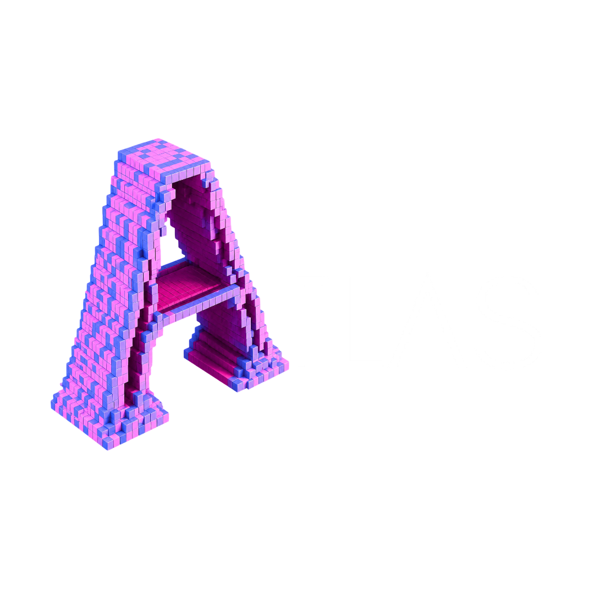

<p align="center">
  
</p>

<p align="center">
  <strong>The Interactive Atlas of Modern Software Engineering</strong><br />
  <a href="https://rps-atlas.netlify.app/">rps-atlas.netlify.app</a>
  ·
  <a href="https://atlas.rudrapratap.dev/">atlas.rudrapratap.dev</a>
</p>

---

I built ATLAS as an engineering publication for people who want to understand complex software systems—not at a surface level, but deeply enough to reason about real production trade-offs.

I do not write beginner tutorials or framework walkthroughs. I start with questions that experienced engineers actually ask: *Why is sharding usually a last resort?* *How does Stripe prevent double charges?* *What really happens during a single ChatGPT request?* From there, each piece builds a complete mental model—from first principles through to how these systems behave at scale.

## What I cover

- Distributed Systems
- Databases and Storage Engines
- Rate Limiting and Edge Proxies
- AI Infrastructure and ML Systems
- Networking and Operating Systems
- System Design and Cloud Architecture
- Performance, Reliability, and Backend Infrastructure

## How I teach

I design every publication to connect theory with practice. A typical ATLAS piece may combine:

- Long-form technical writing
- Architecture diagrams and Mermaid walkthroughs
- Step-by-step execution visualizations
- Production case studies and implementation notes
- Source-backed code excerpts and evidence labels
- Interactive exploration where it earns its keep

My focus is always on **why** a system is shaped the way it is, **what** it costs you in trade-offs, and **when** it belongs—or does not belong—in production.

## What this repository is

This repository is the full ATLAS web application—designed, implemented, and documented by me. It ships as a static React SPA with route-level code splitting, a shared docs component system, and Netlify-ready deploy config.

### Featured technical guides

| Guide | What it is | Live entry |
| ----- | ---------- | ---------- |
| **PebbleDB** | Companion docs for my Go LSM-tree storage engine (50+ pages: architecture, internals, implementation, testing, debugging, reference) | [`/project-docs/guide`](https://rps-atlas.netlify.app/project-docs/guide) |
| **Distributed Rate Limiter** | 54-page source-backed case study of a Go sidecar + Redis/Lua rate limiting platform (architecture, engine, resilience, routing, observability, performance lab, production, verification, journal) | [`/docs/distributed-rate-limiter/introduction/start-here`](https://rps-atlas.netlify.app/docs/distributed-rate-limiter/introduction/start-here) |

- [PebbleDB](https://github.com/RUDRA-PRATAP-SINGH01/PebbleDB) — high-performance LSM-tree storage engine in Go
- [Distributed Rate Limiter](https://github.com/RUDRA-PRATAP-SINGH01/Distributed-rate-limiter) — implementation this Atlas guide documents (source of truth for claims)

Also included: marketing landing page (GSAP + Locomotive Scroll), project docs hub, Ctrl+K search, sidebar + on-this-page navigation, Mermaid diagrams, and syntax-highlighted code blocks.

## Stack

| Layer | Technology |
| ----- | ---------- |
| UI | React 19 |
| Build | Vite 8 |
| Routing | React Router 7 (`BrowserRouter`) |
| Styling | Tailwind CSS 4 + `src/core/styles/index.css` |
| Docs UI | Shared component system under `src/features/docs/components/system/` |
| Animation | GSAP, Locomotive Scroll (landing only) |
| Diagrams | Mermaid 11 (lazy-loaded, viewport-gated, cached) |
| Lint | Oxlint |
| Hosting | Netlify (static SPA) |
| Node | 22 (see `.nvmrc`; `engines.node >= 20`) |

## Architecture overview

```
Browser
  └── src/main.jsx
        └── src/app/App.jsx              # BrowserRouter + Suspense
              └── src/core/routing/AppRoutes.jsx
                    └── lazy pages (src/core/routing/lazyPages.js)
                          ├── features/landing/
                          ├── features/blog/
                          └── features/docs/
                                ├── PebbleDB guide pages
                                └── rate-limiter/ (shell + lazy section registry)
```

- **Route-level code splitting** — pages load via `React.lazy` in `src/core/routing/lazyPages.js`
- **Path alias** — `@/` → `src/` (Vite + `jsconfig.json`)
- **Rate Limiter docs** — light nav metadata in `registry/nav.js`; page bodies lazy-load per section (`rl-section-*` chunks)
- **Docs component system** — callouts, evidence badges, tables, metrics, Mermaid shell, code blocks, decision/limitation primitives
- **Search** — `src/features/docs/engine/docsIndex.js` powers Ctrl+K across PebbleDB + Rate Limiter routes
- **Mermaid** — isolated vendor chunk; runtime loads only when a diagram is near the viewport

## Project structure

```
atlas.rudrapratap.dev/
├── public/
│   ├── _redirects                 # SPA fallback + legacy RL redirects
│   ├── fonts/                     # Poppins, Manrope (woff2)
│   └── images/                    # Logo, hero, project cards
├── src/
│   ├── main.jsx
│   ├── app/App.jsx
│   ├── core/
│   │   ├── components/            # RouteFallback, shared UI
│   │   ├── hooks/
│   │   ├── routing/               # AppRoutes, lazyPages
│   │   └── styles/index.css       # Global styles + docs tokens import
│   └── features/
│       ├── landing/               # Marketing landing
│       ├── blog/
│       └── docs/
│           ├── components/        # DocsNavbar, DocsSidebar, DocsMermaid, GoCodeBlock
│           │   └── system/        # Reusable docs primitives (A–H families)
│           ├── engine/            # docsIndex, references
│           └── pages/
│               ├── ProjectDocsPage.jsx, IntroDocsPage.jsx, …
│               ├── architecture/, core-components/, internals/, …
│               └── rate-limiter/
│                   ├── RateLimiterDocPage.jsx
│                   ├── components/RLDocBlocks.jsx
│                   └── registry/  # nav.js + section modules (54 pages)
├── index.html
├── netlify.toml                   # Build, redirects, cache, security headers
├── vite.config.js
├── package.json
├── .nvmrc
└── README.md
```

## Route map

| URL prefix | Feature |
| ---------- | ------- |
| `/` | Landing |
| `/blog` | Blog |
| `/project-docs` | Docs hub |
| `/project-docs/reference` | Reference overview |
| `/project-docs/guide/**` | PebbleDB technical guide |
| `/docs/distributed-rate-limiter/:section/:slug` | Rate Limiter guide (54 pages) |
| `/project-docs/guide/rate-limiter/*` | Legacy → 301 to new Rate Limiter entry |

### Rate Limiter sections

Introduction · Architecture · Rate Limiting Engine · Resilience · Request Routing · Observability · Performance Lab · Production Engineering · Correctness & Verification · Engineering Journal

## Docs component system

Repeated doc patterns live in `src/features/docs/components/system/`:

| Family | Examples |
| ------ | -------- |
| Structure | `DocsHeader`, `DocsSection`, `DocsGrid`, `RelatedPages`, `PageNavigation`, `OnThisPage` |
| Callouts | `TechnicalCallout` |
| Evidence | `EvidenceBadge`, `EvidencePanel` |
| Metrics | `MetricCard`, `MetricGrid`, `LatencySummary`, `BenchmarkTable` |
| Diagrams | `MermaidDiagram`, `RequestFlow`, `FlowStep`, `Timeline` |
| Code | `CodeBlock`, `CopyButton`, `SourceExcerpt`, `CodeTabs` |
| Tables | `DocsTable`, `ComparisonTable`, `FailureMatrix`, `GuaranteeMatrix` |
| Decisions | `DecisionRecord`, `Invariant`, `Guarantee`, `Limitation`, `TradeoffPanel` |

Rate Limiter pages import via `RLDocBlocks.jsx` (compatibility aliases) or directly from the system module.

### Adding a PebbleDB doc page

1. Create the page under `src/features/docs/pages/…`
2. Add a lazy import in `src/core/routing/lazyPages.js`
3. Register the route in `src/core/routing/AppRoutes.jsx`
4. Add a search entry in `src/features/docs/engine/docsIndex.js`
5. Link it from `src/features/docs/components/DocsSidebar.jsx` if it belongs in the nav

### Adding a Rate Limiter doc page

1. Add the page object to the matching section file under `src/features/docs/pages/rate-limiter/registry/`
2. Register slug + section in `registry/nav.js` (`canonicalNavigationOrder` + `pageTitles`)
3. Add a search entry in `docsIndex.js`
4. Link from `DocsSidebar.jsx`

```jsx
import { TechnicalCallout, MermaidDiagram, SourceExcerpt } from "@/features/docs/components/system";
```

## Getting started

Requirements: **Node.js 20+** (22 recommended).

```bash
npm install
npm run dev
```

Open [http://127.0.0.1:5173](http://127.0.0.1:5173).

### Scripts

| Command | Description |
| ------- | ----------- |
| `npm run dev` | Vite development server |
| `npm run build` | Production build → `dist/` |
| `npm run preview` | Serve the production build locally |
| `npm run lint` | Oxlint |
| `npm run netlify:build` | `npm ci && npm run build` (CI-style) |

## Deploy on Netlify

Configured in-repo—no environment variables required:

- `netlify.toml` — `npm ci && npm run build`, publish `dist`, Node 22, SPA fallback, legacy redirects, cache + security headers
- `public/_redirects` — same SPA + legacy redirects (copied into `dist/` on build)
- `.nvmrc` — Node 22

**Option A: Connect Git (recommended)**

1. Push this repo to GitHub
2. Netlify → **Add new site** → **Import an existing project**
3. Leave Build command / Publish directory blank so `netlify.toml` wins
4. Deploy, then attach `atlas.rudrapratap.dev` under Domain settings if needed

**Option B: Netlify CLI**

```bash
npm install -g netlify-cli
npm run netlify:build
netlify deploy --prod --dir=dist
```

**Option C: Drag and drop**

```bash
npm run build
```

Upload `dist/` at [Netlify Drop](https://app.netlify.com/drop).

**Verify after deploy**

- `/` loads the landing page
- Refresh on a deep PebbleDB URL still works (SPA fallback)
- `/docs/distributed-rate-limiter/introduction/start-here` loads
- `/project-docs/guide/rate-limiter/introduction` 301s to the new Rate Limiter docs
- Ctrl+K search works on docs pages

**Local production preview**

```bash
npm run build
npm run preview
```

### Deploy elsewhere

```bash
npm run build
```

Deploy `dist/` to Vercel, Cloudflare Pages, GitHub Pages, or any static host. Configure SPA fallback so all routes serve `index.html`.

## Performance decisions

- Initial JS excludes doc page bodies and Mermaid; they load on navigation
- Rate Limiter sections split into separate Vite chunks (`rl-section-*`)
- Mermaid is a dedicated vendor chunk and only initializes near the viewport
- Copy-to-clipboard is an isolated interactive island; code highlighting stays lightweight/custom
- Locomotive Scroll loads only on the landing page
- Fingerprinted `/assets/*` and fonts get long-cache headers; `index.html` is always revalidated

## License

Private repository. All rights reserved unless otherwise noted.
